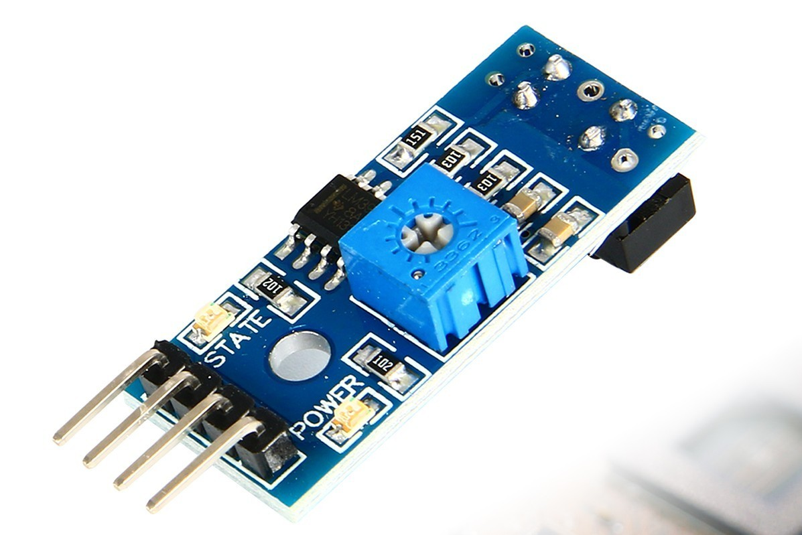
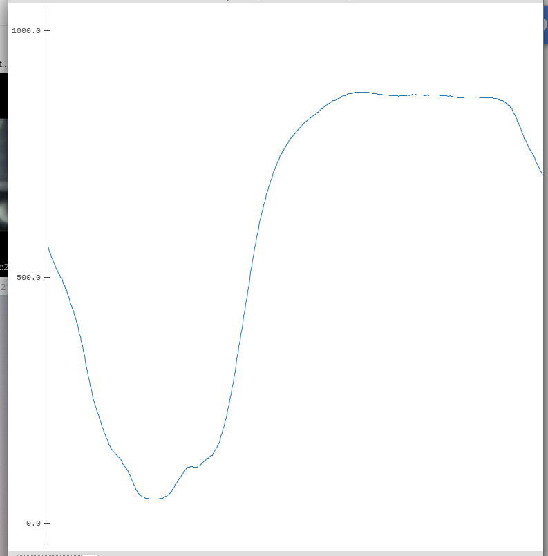
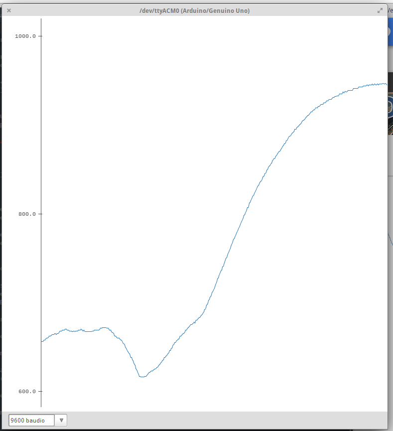
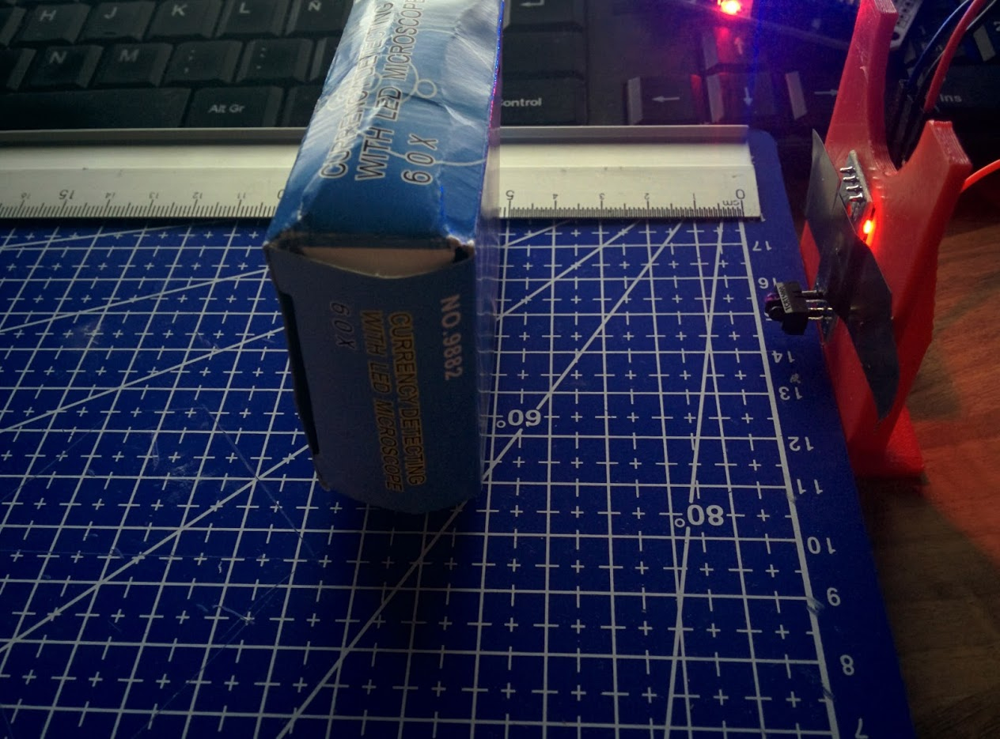
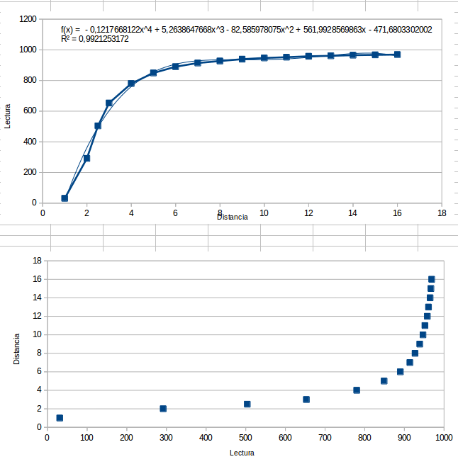
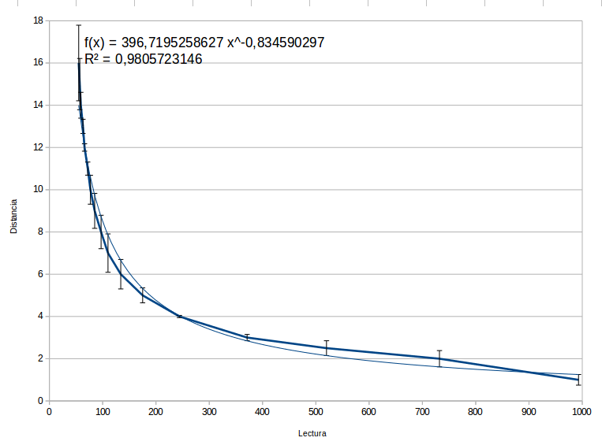

# Solve Laberinth

El sensor IR que uso es [este](http://es.aliexpress.com/item/5x-TCRT5000-Infrared-Reflectance-Sensor-Obstacle-Avoidance-Track-Module-IR-TE364/32493457475.html?spm=2114.13010608.0.96.FsjovU)

Usa sensores de tipo TCRT5000 Módulo IR TE364

Aprovechando el pin A0 (que es el analógico) se pueden medir perfectamente distancias entre 1 y 6cm (alguno más si lo haces con cuidado).

Podemos ver en una gráfica donde se ve que se puede usar todo el rango 0-1023

Si tenemos luz ambiente, lo que necesitamos es calibrar el nivel de luz ambiental. En esta imagen he usado el monitor encendido para medir las distancias, con el mismo resultado de distancias, pero a partir del 600

Podemos ver el resultado con algo tan sencillo como este programa y el Serial Plotter

    void setup() {
    Serial.begin(9600);

    }

    void loop() {
    Serial.println(analogRead(A0));

    }

Podemos complicarlo más  usando varios sensores y definiendo umbrales.

Vamos a comprobar la calidad de la medida haciendo una tabla de valores medidos

Usaremos el siguiente sistema de medida

Vemos los datos [(Enlace al fichero de datos)](./AjusteDatos.ods)

|Distancia|	Lectura
|---|---
|1|	31
|2|	292
|2,5|	504
|3|	653
|4|	780
|5|	849
|6|	890
|7|	914
|8|	927
|9|	939
|10|	947
|11|	952
|12|	958
|13|	961
|14|	965
|15|	967
|16|	969

Si dibujamos las curvas vemos que cláramente se puede decir que los datos son fiables

Para resolver el tema, tendríamos que encontrar una aproximación a la curva distancia/lectura (siempre podemos aproximar por un conjunto de rectas)

Un aproximación nos da como función

distancia=396,72*POTENCIA(1023-lectura;-0,83459)

Vemos la aproximación junto a los datos medidos donde se han calculado también las cotas de error, siendo este bastante aceptable.

Sólo queda implementarlo en Arduino y probarlo con algunos sensores más
